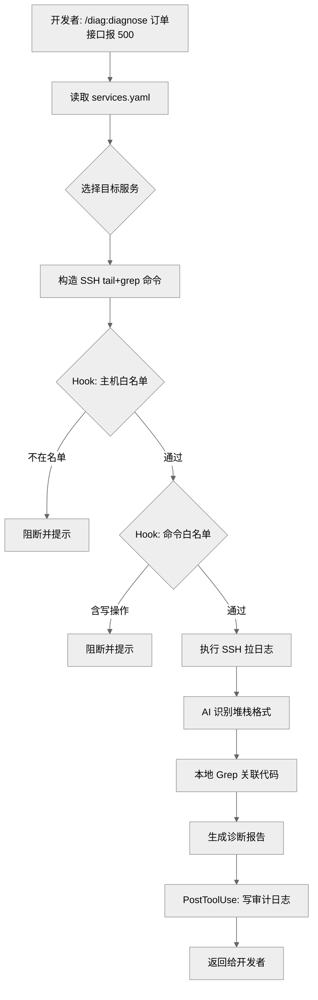

# REQ-001: 生产诊断插件 - 报错定位 MVP

## 元信息

| 属性 | 值 |
|-----|-----|
| 编号 | REQ-001 |
| 类型 | 全栈 |
| 状态 | 开发中 |
| 模块 | 生产诊断 |
| 优先级 | P2 |
| 创建日期 | 2026-04-20 |
| 负责人 | haiqing |
| branch | feat/REQ-001-diag-plugin-mvp |
| issue | - |

## 生命周期

<!-- 需求状态流转：草稿 → 待评审 → 评审通过 → 开发中 → 测试中 → 已完成 -->

- [x] 草稿（编写中）
- [x] 待评审
- [x] 评审通过
- [x] 开发中
- [ ] 测试中
- [ ] 已完成

---

## 一、需求描述

### 1.1 背景

参考项目 [claude-safe-ops](https://github.com/zhouhao4221/claude-safe-ops) 已经覆盖了通用服务器运维场景（自然语言执行 SSH 动作 + 风控引擎），但在日常开发中，我们真正高频的场景不是"让 AI 帮忙执行运维动作"，而是"让 AI 帮忙**看**生产、**分析**问题、**给建议**"。

目前开发者排查生产报错时，典型流程是：收到报错反馈 → 手动 SSH 进应用服务器 → tail/grep 日志 → 找到堆栈 → 回到本地 IDE 对着堆栈 grep 代码 → 判断原因。这个过程可以被 AI 显著加速，但直接引入通用运维类 AI 工具会带来"AI 能不能动生产"的疑虑，团队信任成本高。

因此需要一个**明确只读、边界清晰、风控严格**的生产诊断插件，作为 devflow-claude 工具集的新成员。

### 1.2 目标

- **功能目标**：在 devflow-claude 下新增 `plugins/diag/` 插件，提供自然语言驱动的生产报错定位能力（拉日志 → 解析堆栈 → 关联代码 → 生成修复建议），全程只读、不触达任何写操作。
- **效果目标**：
  - 单次报错定位耗时从"人工 10-20 分钟"压缩到"AI 1-3 分钟"
  - 通过命名（`diag`）+ 风控 Hook 让团队在看到插件前缀时就确信"不会动生产"

### 1.3 客户场景

> 记录客户提出的原始业务场景和诉求

- **场景1**：开发收到生产报错反馈（QA / 监控 / 用户），想快速知道错在哪、是不是自己最近改的东西引起的，不想一步步手动 SSH + grep
- **场景2**：开发想让 Claude 帮忙看生产日志，但担心 AI 在 SSH 里误操作（误删、误改配置、误 kill 进程），不敢放手
- **场景3**：多个服务技术栈不一样（Java、Node、Go 混合），不想为每个栈单独配置解析规则

### 1.4 价值

- **效率价值**：显著降低报障 → 定位的平均时长
- **安全价值**：用只读边界 + Hook 强制 + 审计日志三层保护消除"AI 误操作生产"的焦虑
- **扩展价值**：为后续数据库只读诊断、健康巡检、慢 SQL 分析等场景打下模块基础

### 1.5 范围与边界

> 明确本期做什么、不做什么，防止范围蔓延

- **本期包含**：
  - `plugins/diag/` 插件骨架（plugin.json、commands、hooks、scripts、templates）
  - 三个命令：`/diag:init`（初始化配置）、`/diag:diagnose <描述>`（报错定位主流程）、`/diag:audit`（审计日志查询）
  - 配置文件：`~/.claude-diag/config/services.yaml`（服务清单、主机白名单、日志路径）
  - 五类风控 Hook：SSH 命令白名单、目标主机白名单、写类命令阻断、敏感输入拦截、Hook 完整性校验
  - 审计日志：JSONL 格式落地 `~/.claude-diag/audit/command_audit.jsonl`
  - 修复建议纯文字输出，不自动 Edit 代码
- **本期不做**：
  - 数据库只读诊断（账号/连接串管理方案待定，下一期）
  - 健康巡检、慢 SQL 分析、数据核对
  - 集成 ELK / Loki / Prometheus / SLS 等日志系统（只支持 SSH + 文件日志）
  - 自动生成 patch 或 PR
  - 多平台凭证管理（本期复用系统 SSH Agent / ~/.ssh/config）

### 1.6 干系人

> 除了提出方，还有哪些人会因此变化受影响

| 角色 | 关注点 | 备注 |
|------|-------|------|
| 提出方 | 能否显著提速报错定位 | - |
| 项目开发者 | 使用体验、能否适配自己技术栈的日志格式 | 主要用户 |
| 运维同学 | 审计可追溯、SSH 权限合规 | 关注 Hook 有效性和审计完整性 |
| 安全同学 | 敏感信息不泄漏、只读边界强度 | 关注敏感输入拦截和写操作阻断 |

---

## 二、功能清单

> 列出所有功能点，开发完成后勾选

- [x] **F1 `/diag:init` 命令**：初始化 `~/.claude-diag/` 目录结构，生成服务清单模板（`services.yaml`），引导用户补齐主机/日志路径
- [x] **F2 `/diag:diagnose <描述>` 命令**：报错定位主流程（读取配置 → SSH 拉日志 → 解析堆栈 → 本地 grep 代码 → 生成诊断报告）
- [x] **F3 `/diag:audit` 命令**：查询审计日志，支持按时间/主机/风险等级过滤
- [x] **F4 Hook: SSH 命令白名单**：PreToolUse on Bash，SSH 命令参数只允许 `tail/head/cat/grep/awk/sed/less/wc/find -name/ls/ps/df/free/uptime`，其他阻断
- [x] **F5 Hook: 目标主机白名单**：PreToolUse on Bash，SSH 目标主机必须在 `services.yaml` 中登记，否则阻断
- [x] **F6 Hook: 写类命令阻断**：PreToolUse on Bash，管道写入文件（`> / >> / tee`）、写类命令（rm/mv/cp/chmod/chown/kill/systemctl/service/docker 写操作/kubectl 写操作）直接阻断
- [x] **F7 Hook: 敏感输入拦截**：UserPromptSubmit，检测用户消息中的疑似 token/密码/密钥，拦截并提示安全注入方式
- [x] **F8 Hook: 完整性校验**：PreToolUse on Bash（每会话首次），验证上述 Hook 全部注册且脚本可执行，缺失则告警
- [x] **F9 审计日志落地**：PostToolUse on Bash，所有 SSH 命令、拉取日志片段、产出建议写入 JSONL
- [x] **F10 AI 自适应堆栈解析**：不写死语言/框架规则，由 AI 从日志片段中识别异常堆栈格式（Java/Node/Python/Go 等）
- [x] **F11 本地代码关联**：基于堆栈中的类名/方法名/文件名，在当前仓库 Grep 定位源码位置
- [x] **F12 诊断报告输出**：固定格式（原因 + 相关代码 + 修复建议 + 审计提醒），修复建议纯文字、不触发 Edit

---

## 三、业务规则

| 类型 | 规则 | 说明 |
|------|-----|------|
| 数据校验 | 服务配置必填字段 | `services.yaml` 中每个服务必须包含 `name`、`host`、`log_paths`，缺失则 `/diag:init` 校验失败 |
| 权限控制 | SSH 目标主机白名单 | 未在 `services.yaml` 登记的主机，SSH 连接请求一律阻断 |
| 权限控制 | SSH 命令白名单 | 只允许只读命令及参数组合，其他直接阻断（不是"确认"是"拦截"） |
| 权限控制 | 写操作全禁 | 管道重定向到文件、写类命令、删改命令一律阻断 |
| 权限控制 | 代码零改动 | 修复建议以纯文字给出，禁止 AI 自动调用 Edit/Write 工具改动仓库代码 |
| 安全 | 敏感输入拦截 | 用户聊天中输入 token/密码/密钥被识别时，消息在到达 AI 前被拦截，并提示安全注入方式（SSH Agent、配置文件等） |
| 安全 | Hook 防绕过 | 每会话首次 Bash 调用时校验所有风控 Hook 仍在 `.claude/settings.json` 中注册且可执行 |
| 审计 | 审计全量 | SSH 命令、执行耗时、退出码、拉取日志摘要、产出建议摘要全部落 JSONL |
| 审计 | 保留周期 | 审计日志本地保留 30 天，支持按时间切分文件 |
| 非功能约束 | 配置驱动 | 支持多服务、多栈混合登记；堆栈解析不写死规则，由 AI 自适应识别 |
| 非功能约束 | 只依赖系统 SSH | 本期不引入独立 SSH 客户端或密钥管理，复用系统 `ssh` + `~/.ssh/config` + SSH Agent |

---

## 四、使用场景

### 场景1：报错定位主流程

- **角色**：项目开发者
- **前置条件**：
  - 已执行 `/diag:init` 并在 `services.yaml` 中登记目标服务
  - 本地 SSH 能通过 key / Agent 登录目标主机（不通过插件做凭证管理）
  - 所有风控 Hook 已注册
- **基本流程**：
  1. 开发者输入 `/diag:diagnose 订单提交接口刚才报 500` → 插件读取 `services.yaml`，让用户选择目标服务（或根据描述匹配）
  2. 插件执行 SSH 命令 `ssh <host> 'tail -n 2000 <log_path> | grep -B2 -A 30 ERROR'` → Hook 校验主机在白名单、命令在白名单、无写操作 → 放行
  3. 日志片段返回，AI 自适应识别堆栈格式（Java/Node/Python/Go 等），抽取异常类、方法、文件、行号
  4. 插件在当前仓库 Grep 堆栈里的类名/方法名 → 定位本地源码位置
  5. AI 生成诊断报告：`🔴 原因` + `📂 相关代码` + `💡 修复建议` + `🛑 未改动任何代码`
  6. PostToolUse Hook 将本次 SSH 命令、日志摘要、产出建议写入审计 JSONL
- **异常流程**：
  - 目标主机不在白名单 → Hook 直接阻断，提示用户先 `/diag:init` 登记
  - SSH 命令含黑名单关键字（如 `rm`、`>`）→ Hook 阻断，提示用户命令被拦截的具体规则
  - 日志中无 ERROR 片段 → 提示扩大时间窗或检查日志路径
  - 堆栈格式 AI 无法识别 → 降级为"返回原始日志片段 + 用户自行判断"

### 场景2：配置服务清单

- **角色**：项目开发者（首次使用）
- **前置条件**：已安装 devflow-claude 并启用 diag 插件
- **基本流程**：
  1. 开发者执行 `/diag:init` → 插件创建 `~/.claude-diag/config/services.yaml` 模板
  2. 插件交互式询问首个服务信息：服务名、host、日志路径、（可选）语言提示
  3. 开发者补齐并确认 → 写入 `services.yaml`
  4. 插件执行一次"空跑"测试（`ssh <host> 'echo ok'` + Hook 校验链）→ 确认风控生效
  5. 提示下一步可执行 `/diag:diagnose`
- **异常流程**：
  - SSH 不通 → 提示用户配置 `~/.ssh/config` 或检查 SSH Agent
  - Hook 未注册 → 提示用户重启 Claude Code 或检查 `.claude/settings.json`

### 场景3：审计追溯

- **角色**：运维/安全同学
- **前置条件**：审计日志已累积
- **基本流程**：
  1. 执行 `/diag:audit` → 默认展示最近 7 天操作摘要（按主机聚合）
  2. 支持过滤：`--host=web-01`、`--from=2026-04-20`、`--to=2026-04-20`
  3. 输出每条记录：时间、主机、命令、退出码、操作者、拉取日志片段哈希、产出建议摘要
- **异常流程**：
  - 审计文件损坏 → 提示文件路径并降级为"原始 JSONL 输出"

---

## 五、数据与交互

> 本需求为 Claude Code 插件开发，不涉及后端 API 或前端页面。此处记录插件对外暴露的**命令能力**和**配置契约**。

### 插件命令能力

| 能力 | 输入 | 输出 | 说明 |
|------|------|------|------|
| `/diag:init` | （无参数，交互式） | 创建配置目录 + 服务清单模板 + 注册 Hook | 首次配置，幂等 |
| `/diag:diagnose <描述>` | 自然语言报错描述（可选指定服务） | 诊断报告（原因 + 代码位置 + 修复建议） | 主流程，全程只读 |
| `/diag:audit [--host] [--from] [--to]` | 过滤条件 | 审计记录列表 | 只读查询 |

### 配置文件契约

`~/.claude-diag/config/services.yaml`：

```yaml
services:
  - name: order-api
    host: prod-web-01
    log_paths:
      - /var/log/app/order-api.log
    language_hint: java  # 可选，仅作 AI 识别提示
  - name: user-service
    host: prod-web-02
    log_paths:
      - /var/log/app/user.log
```

### 审计记录契约

`~/.claude-diag/audit/command_audit.jsonl`（每行一条 JSON）：

| 字段 | 类型 | 说明 |
|------|------|------|
| `timestamp` | ISO-8601 | 操作时间 |
| `host` | string | 目标主机 |
| `command` | string | 完整 SSH 命令 |
| `exit_code` | int | 退出码 |
| `log_snippet_hash` | string | 拉取日志片段 SHA-256（不存全文避免泄漏） |
| `advice_summary` | string | AI 建议摘要（前 200 字符） |
| `operator` | string | 本地 whoami |
| `hook_checks_passed` | array | 本次通过的 Hook 校验列表 |

---

## 六、测试要点

### 6.1 技术测试

- [x] **T1 主机白名单拦截**（smoke.sh T1a-c）：登记通过 / 未登记拒绝 / 非 ssh 忽略
- [x] **T2 命令白名单拦截**（smoke.sh T2a-e）：tail 通过 / grep 管道通过 / curl 拒绝 / 登录 shell 拒绝 / rm 拒绝
- [x] **T3 写类命令阻断**（smoke.sh T3a-j）：重定向 / tee / systemctl / docker rm / kubectl delete / mysql INSERT / sudo / find -delete / apt install 全部拒绝
- [x] **T4 敏感输入拦截**（smoke.sh T4a-e）：password / bearer / AWS / sk-key 拒绝，普通消息通过
- [x] **T5 Hook 完整性**（smoke.sh T5a-b）：全部存在放行 / 删除一个后拒绝
- [ ] **T6 堆栈解析兼容性**：分别用 Java(Spring)、Node(Nest)、Python(Django)、Go(Gin) 的日志样本测试 AI 堆栈识别（**依赖 AI 行为 + 真实日志样本，测试阶段人工验证**）
- [ ] **T7 代码关联**：堆栈中的类名/方法名能在本地仓库 Grep 到对应源码位置（**依赖真实代码仓库，测试阶段人工验证**）
- [ ] **T8 零改动验证**：诊断流程中任何工具调用都不应触发 Edit/Write 到仓库代码（**靠 command 的 allowed-tools 约束 + 命令文档明示，测试阶段人工验证**）
- [x] **T9 审计完整性**（smoke.sh T9）：一次完整 SSH 调用后 JSONL 字段齐全（timestamp/session_id/operator/host/service/command/exit_code/stdout_length/log_snippet_hash/hooks_passed）
- [ ] **T10 审计查询**：`/diag:audit --host=X --from=Y` 过滤正确（**命令已实现，测试阶段运行真实 `/diag:audit` 验证**）

**自动化测试**：`bash plugins/diag/tests/smoke.sh` → 26/26 通过

### 6.2 验收标准

> 产品/业务方验收时的确认项，描述可观测的业务结果

- [ ] **V1 端到端跑通**：在真实项目上用 `/diag:diagnose` 能成功定位一次生产报错，耗时 < 3 分钟
- [ ] **V2 风控感知**：团队成员看到 `/diag:*` 前缀能准确回答"这个插件能不能动生产"（应为"不能"）
- [ ] **V3 审计透明**：开发者能在 `/diag:audit` 中看到自己本周所有诊断操作的完整记录
- [ ] **V4 扩栈成本低**：新增一个不同栈的服务（只改 `services.yaml`），无需改插件代码即可诊断
- [ ] **V5 无误操作**：UAT 期间所有诊断会话中，零写操作发生、零代码改动、零生产资源修改

---

## 七、图示（可选）

> 用 Mermaid 绘制，GitHub/Gitea 原生渲染。主题建议统一用 `neutral`（打印友好、明暗模式兼容）。

### 7.1 诊断主流程



### 7.2 风控 Hook 分层


---

## 八、评审记录

| 日期 | 评审人 | 结论 | 意见 |
|-----|-------|------|------|
| 2026-04-20 | - | 待评审 | 已提交评审，等待审阅 |
| 2026-04-20 | haiqing | 通过 | 范围清晰收敛；只读边界明确；风控 Hook 三重拦截 + 零 Edit 约束可行；已识别的风险项（SSH 参数白名单覆盖、非主流栈识别准确率、services.yaml 多人同步）在开发阶段重点关注 |

---

## 九、变更记录

| 日期 | 变更内容 | 影响范围 |
|-----|---------|---------|
| 2026-04-20 | 初始版本 | - |
| 2026-04-20 | 提交评审（草稿 → 待评审） | 状态流转 |
| 2026-04-20 | 评审通过（待评审 → 评审通过） | 状态流转 |
| 2026-04-20 | 启动开发（评审通过 → 开发中），创建分支 feat/REQ-001-diag-plugin-mvp，填充实现方案 | 状态流转 + 实现方案 |
| 2026-04-20 | Stage 1-4 全部完成，12 功能点全部实现，smoke.sh 26/26 通过；T6-T8/T10 待测试阶段人工验证 | 开发完成 |

---

## 十、关联信息

- **关联需求**：-
- **相关文档**：
  - [claude-safe-ops](https://github.com/zhouhao4221/claude-safe-ops) - 参考的安全运维项目，本插件与其定位互补（它管执行，本插件管只读诊断）
- **假设**：
  - 假设开发者本地已有 SSH 密钥且能通过 `ssh <host>` 直连目标主机（通过 `~/.ssh/config` + SSH Agent），插件不接管凭证管理
  - 假设目标服务的错误日志集中在文件中（而非全部走 ELK/SLS），MVP 阶段仅支持文件日志
  - 假设 Claude 对主流语言（Java/Node/Python/Go）的异常堆栈格式有足够识别能力，无需编写专用解析器
- **外部依赖**：
  - 系统 SSH 客户端 + SSH Agent
  - Claude Code Hook 机制（PreToolUse / PostToolUse / UserPromptSubmit）
  - 目标服务器的日志可读权限
- **风险项**：
  - **技术风险**：Hook 对 SSH 命令的参数解析需要覆盖各种变体（`ssh -i`、`ssh user@host`、单引号/双引号），白名单判断可能出现绕过或误伤
  - **技术风险**：AI 对非常见栈（Ruby/Rust/Elixir）的堆栈识别准确率待验证
  - **产品风险**：团队对"只读 + 建议"的接受度未知，若大家习惯了"让 AI 直接改"，价值感可能打折
  - **运维风险**：SSH 主机白名单放在本地配置，多人协作时同步机制缺失（后续需求解决）

---

## 十一、实现方案

> 本章节在 `/req:dev` 阶段由 AI 分析代码后自动生成，创建需求时无需填写。

### 11.1 数据模型

本插件无数据库，核心是两份**数据契约**：

#### A. 服务配置 `~/.claude-diag/config/services.yaml`

```yaml
services:
  - name: order-api           # 必填，服务标识，唯一
    host: prod-web-01         # 必填，对应 ~/.ssh/config Host 或 user@ip
    log_paths:                # 必填，至少 1 条
      - /var/log/app/order-api.log
    language_hint: java       # 可选，AI 堆栈识别提示
    tags: [backend, order]    # 可选，筛选用
```

校验规则：`name` 唯一；`host`、`log_paths` 非空；`language_hint` 枚举 `java/node/python/go/ruby/php/其他/空`。

#### B. 审计记录 `~/.claude-diag/audit/command_audit-YYYY-MM-DD.jsonl`

每日切分，保留 30 天。每行一条 JSON：

| 字段 | 类型 | 说明 |
|---|---|---|
| `timestamp` | ISO-8601 | 精确到秒 |
| `session_id` | string | Claude Code 会话标识 |
| `operator` | string | 本地 `whoami` |
| `host` | string | 目标主机（必在白名单内） |
| `service` | string | 关联服务名 |
| `command` | string | 完整 SSH 命令 |
| `exit_code` | int | SSH 进程退出码 |
| `duration_ms` | int | 执行耗时 |
| `log_snippet_hash` | string | 拉取日志 SHA-256（不存全文，避免敏感泄漏） |
| `advice_summary` | string | AI 诊断摘要前 200 字 |
| `hooks_passed` | array<string> | 通过的 Hook 列表 |

### 11.2 API 设计

> 本插件无 HTTP API，对外契约以 Slash 命令 + Hook + Skill 的形式呈现。

| 类型 | 名称 | 说明 |
|---|---|---|
| Slash 命令 | `/diag:init` | 初始化 `~/.claude-diag/` + 生成配置模板 + 空跑验证 |
| Slash 命令 | `/diag:diagnose <描述>` | 报错定位主流程（SSH 拉日志 → AI 堆栈解析 → 本地代码关联 → 诊断报告） |
| Slash 命令 | `/diag:audit [--host] [--service] [--from] [--to]` | 审计查询（默认近 7 天） |
| Slash 命令 | `/diag` | 入口，展示子命令帮助 |
| Hook: UserPromptSubmit | `sensitive-input-guard.sh` | 拦截用户消息中的 token/password/key |
| Hook: PreToolUse(Bash, 首次) | `validate-hooks.sh` | 校验 Hook 注册完整性 |
| Hook: PreToolUse(Bash) | `host-whitelist.sh` | SSH 目标主机白名单 |
| Hook: PreToolUse(Bash) | `command-whitelist.sh` | SSH 远程命令白名单 |
| Hook: PreToolUse(Bash) | `write-guard.sh` | 写操作/重定向阻断 |
| Hook: PostToolUse(Bash) | `audit-log.sh` | 审计日志落 JSONL |
| Skill | `stack-analyzer` | AI 自适应识别多栈异常堆栈 |

**SSH 命令白名单**（可执行动词）：

```
tail | head | cat | grep | awk | sed | less | wc | find | ls | ps | df | free | uptime | stat | readlink | file
```

**黑名单关键字**（命中即阻断）：

```
重定向：> >> | tee
写类动词：rm | mv | cp | chmod | chown | chattr | truncate | dd | mkfs | wipefs
进程控制：kill | pkill | killall
服务控制：systemctl start|stop|restart|reload|enable|disable | service ... start|stop|restart
容器控制：docker (run|stop|rm|rmi|kill|exec -w|system prune) | kubectl (apply|delete|patch|scale|exec -w)
包管理：apt|yum|dnf|pacman|brew install|remove|upgrade
网络写：iptables | ip route add|del | sysctl -w
find 写操作：find ... -delete | find ... -exec
数据库写：mysql -e | psql -c 含 INSERT/UPDATE/DELETE/DROP/ALTER/CREATE/TRUNCATE
```

### 11.3 文件改动清单

**新增**（18 个）：

```
plugins/diag/
├── .claude-plugin/plugin.json              插件清单
├── README.md                               使用说明
├── commands/
│   ├── diag.md                             入口
│   ├── init.md                             /diag:init
│   ├── diagnose.md                         /diag:diagnose
│   └── audit.md                            /diag:audit
├── hooks/
│   ├── hooks.json                          Hook 注册
│   ├── _common.sh                          共享函数（SSH 解析、配置读取）
│   ├── sensitive-input-guard.sh            F7
│   ├── validate-hooks.sh                   F8
│   ├── host-whitelist.sh                   F5
│   ├── command-whitelist.sh                F4
│   ├── write-guard.sh                      F6
│   └── audit-log.sh                        F9
├── scripts/
│   ├── services-config.sh                  读取/校验 services.yaml
│   └── init-diag.sh                        初始化 ~/.claude-diag/
├── skills/stack-analyzer/SKILL.md          F10 堆栈识别
└── templates/services.yaml.template        配置模板
```

**修改**（2 个）：

| 文件 | 改动 |
|---|---|
| `.claude-plugin/marketplace.json` | 注册 diag 插件 |
| `CLAUDE.md` | 新增 diag 插件段落（简介 + 命令 + 与 req/api/pm 的关系 + 风控设计） |

### 11.4 实现步骤

按"**依赖从底到顶**"的顺序，配合 4 个阶段提交：

**Stage 1 — 骨架与配置（步骤 1-3）**

1. 插件骨架：`plugins/diag/{plugin.json, README.md}` + `.claude-plugin/marketplace.json` 注册
2. 配置层：`templates/services.yaml.template` + `scripts/services-config.sh`（读取/校验）+ `scripts/init-diag.sh`（初始化 `~/.claude-diag/`）
3. 共享函数：`hooks/_common.sh`（SSH 命令解析、主机抽取、远程命令抽取、配置读取、JSON 决策输出）

**Stage 2 — 风控 Hook（步骤 4-5）**

4. 5 个 Hook 脚本（按独立性从低到高）：
   - 4.1 `audit-log.sh`（只写不拦，先保证审计可用）
   - 4.2 `sensitive-input-guard.sh`（UserPromptSubmit，独立）
   - 4.3 `host-whitelist.sh`（基于配置层）
   - 4.4 `command-whitelist.sh`（基于 `_common.sh`）
   - 4.5 `write-guard.sh`（基于 `_common.sh`）
   - 4.6 `validate-hooks.sh`（依赖前面全部）
5. `hooks/hooks.json` 注册所有 Hook，设置 matcher（Bash / UserPromptSubmit）、timeout、first-call 语义

**Stage 3 — 命令与技能（步骤 6-7）**

6. 命令（按用户路径）：`init.md` → `diagnose.md` → `audit.md` → `diag.md`（入口）
7. Skill：`stack-analyzer/SKILL.md`（触发于 /diag:diagnose，定义多栈堆栈识别策略）

**Stage 4 — 集成与冒烟（步骤 8-10）**

8. 文档集成：`CLAUDE.md` 新增 diag 插件段落
9. 端到端冒烟：配一个假 services.yaml，跑完整 `/diag:diagnose` 流程
10. 对照 T1-T10 逐条手动验证风控 Hook 生效
