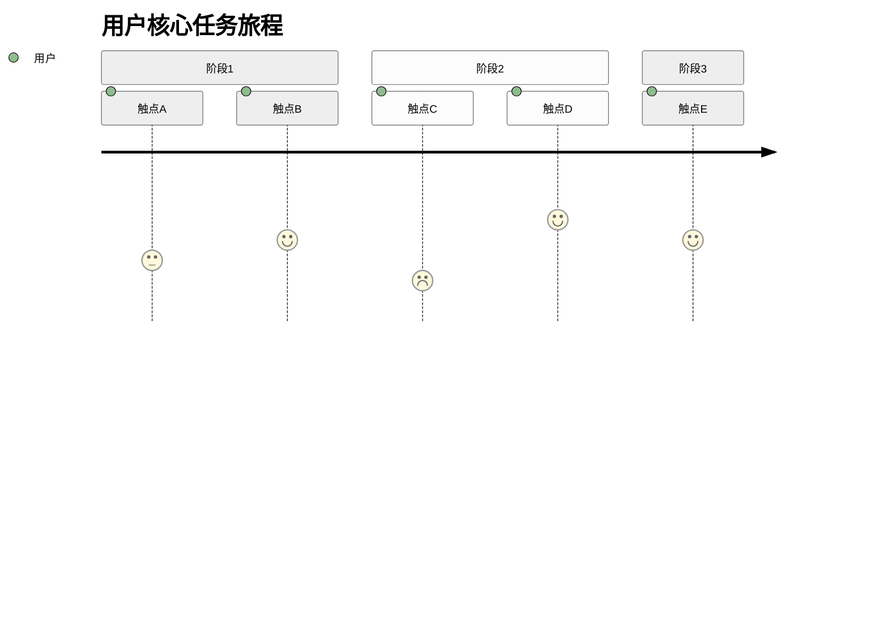
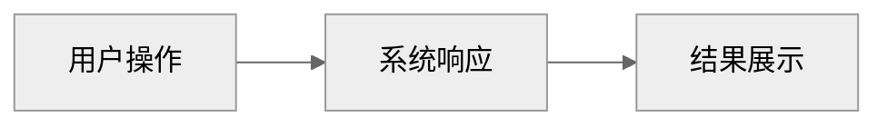

# 产品需求文档 (PRD)

| 字段 | 内容 |
|-----|------|
| 产品名称 | {{PROJECT_NAME}} |
| 文档版本 | v1.0 |
| 创建日期 | {{DATE}} |
| 最后更新 | {{DATE}} |
| 文档负责人 | |
| 状态 | 草稿 / 评审中 / 已批准 |

---

## 修订历史

| 版本 | 日期 | 修改人 | 修改内容 |
|-----|------|-------|---------|
| v1.0 | {{DATE}} | | 初始版本 |

---

## 1. 概述

### 1.1 背景与问题

> 描述当前存在的问题或机会，为什么需要这个产品

**现状**：

**问题**：

**机会**：

### 1.2 产品愿景

> 用一句话描述产品的核心价值主张

### 1.3 目标与成功指标

> 定义可衡量的成功标准

| 目标类型 | 指标 | 当前值 | 目标值 | 衡量方式 |
|---------|-----|-------|-------|---------|
| 业务目标 | | | | |
| 用户目标 | | | | |
| 技术目标 | | | | |

### 1.4 范围定义

**包含（In Scope）**：
- 

**不包含（Out of Scope）**：
- 

---

## 2. 用户研究

### 2.1 目标用户

| 用户角色 | 用户特征 | 使用场景 | 核心痛点 | 期望收益 |
|---------|---------|---------|---------|---------|
| | | | | |

### 2.2 用户旅程

> 描述用户完成核心任务的完整流程。建议用 Mermaid `journey` 图，GitHub/Gitea 原生渲染。

> 分数表示用户情绪（1=糟糕，5=愉悦）。无 Mermaid 需求时可删除代码块，用文字描述。

### 2.3 竞品分析

| 竞品 | 优势 | 劣势 | 我们的差异化 |
|-----|-----|-----|-------------|
| | | | |

---

## 3. 功能需求

### 3.1 功能概览

| 优先级 | 功能模块 | 功能描述 | 用户价值 | MVP |
|-------|---------|---------|---------|-----|
| P0 | | | | 是 |
| P1 | | | | 是/否 |
| P2 | | | | 否 |

### 3.2 功能详情

#### 3.2.1 [功能模块名称]

**功能描述**：

**用户故事**：
> 作为 [用户角色]，我希望 [功能行为]，以便 [获得价值]

**功能流程**：

**业务规则**：
- 规则1：
- 规则2：

**界面原型**：
> 附上原型链接或截图

**验收标准**：
- [ ] 
- [ ] 

**边界情况**：
| 场景 | 处理方式 |
|-----|---------|
| | |

---

## 4. 非功能需求

### 4.1 性能需求

| 场景 | 指标 | 目标值 | 测量方法 |
|-----|-----|-------|---------|
| 页面加载 | 首屏时间 | < 2s | |
| API 响应 | P95 延迟 | < 200ms | |
| 并发能力 | QPS | | |
| 数据量 | 单表记录 | | |

### 4.2 可用性需求

- 系统可用性：99.9%
- 计划内维护窗口：
- 故障恢复时间（RTO）：
- 数据恢复点（RPO）：

### 4.3 安全需求

| 类别 | 需求 | 优先级 |
|-----|-----|-------|
| 认证 | | P0 |
| 授权 | | P0 |
| 数据安全 | | P0 |
| 审计日志 | | P1 |
| 合规要求 | | |

### 4.4 兼容性需求

**Web 端**：
- 浏览器：Chrome、Firefox、Safari、Edge（最新两个版本）

**移动端**：
- iOS：12.0+
- Android：8.0+

**其他**：
- 屏幕分辨率：
- 网络环境：

---

## 5. 数据需求

### 5.1 数据模型

> 描述核心数据实体及其关系

| 实体 | 描述 | 关键字段 |
|-----|-----|---------|
| | | |

### 5.2 数据采集

| 数据点 | 采集时机 | 用途 | 保留期限 |
|-------|---------|-----|---------|
| | | | |

### 5.3 数据报表

| 报表名称 | 维度 | 指标 | 更新频率 |
|---------|-----|-----|---------|
| | | | |

---

## 6. 技术方案

### 6.1 系统架构

> 简要描述技术选型和整体架构

**前端**：
- 框架：
- 状态管理：
- UI 组件库：

**后端**：
- 语言/框架：
- 数据库：
- 缓存：
- 消息队列：

**基础设施**：
- 部署方式：
- 监控告警：
- 日志系统：

### 6.2 第三方依赖

| 服务类型 | 服务商 | 用途 | 备选方案 |
|---------|-------|-----|---------|
| | | | |

### 6.3 接口设计

> 列出关键 API 接口

| 接口 | 方法 | 描述 |
|-----|-----|-----|
| | | |

---

## 7. 发布计划

### 7.1 版本规划

| 版本 | 目标 | 核心功能 | 预计时间 |
|-----|-----|---------|---------|
| MVP | 验证核心假设 | | |
| v1.0 | 正式上线 | | |
| v1.x | 持续迭代 | | |

### 7.2 里程碑

| 里程碑 | 计划时间 | 实际时间 | 状态 | 备注 |
|-------|---------|---------|-----|-----|
| 需求评审通过 | | | 待开始 | |
| 技术方案确定 | | | 待开始 | |
| UI/UX 设计完成 | | | 待开始 | |
| 开发完成 | | | 待开始 | |
| 测试通过 | | | 待开始 | |
| 上线发布 | | | 待开始 | |

### 7.3 灰度策略

> 描述上线的灰度发布计划

---

## 8. 风险管理

### 8.1 风险识别

| 风险 | 类型 | 可能性 | 影响 | 应对措施 | 负责人 |
|-----|-----|-------|-----|---------|-------|
| | 技术/业务/资源 | 高/中/低 | 高/中/低 | | |

### 8.2 依赖项

| 依赖项 | 类型 | 状态 | 风险 |
|-------|-----|-----|-----|
| | 内部/外部 | 已确认/待确认 | |

### 8.3 假设与约束

**假设**：
- 

**约束**：
- 

---

## 9. 需求追踪

> 本章节由 `/req:new` 和 `/req:done` 命令自动维护，记录所有从本 PRD 派生的需求。

| 编号 | 标题 | 模块 | 状态 | 创建日期 | 完成日期 |
|-----|------|------|------|---------|---------|
| - | 暂无需求 | - | - | - | - |

---

## 10. 附录

### 10.1 术语表

| 术语 | 定义 |
|-----|-----|
| | |

### 10.2 参考资料

- 

### 10.3 相关文档

| 文档 | 链接 |
|-----|-----|
| 原型设计 | |
| 技术方案 | |
| 测试用例 | |

---

## 审批记录

| 角色 | 姓名 | 意见 | 日期 |
|-----|-----|-----|-----|
| 产品负责人 | | | |
| 技术负责人 | | | |
| 业务负责人 | | | |

---

> 下一步：完善 PRD 后，可使用 `/req:new <标题>` 创建具体需求
