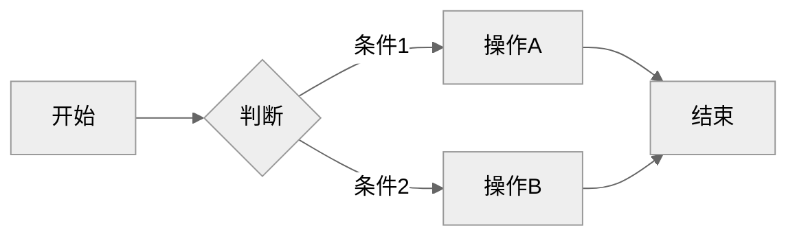
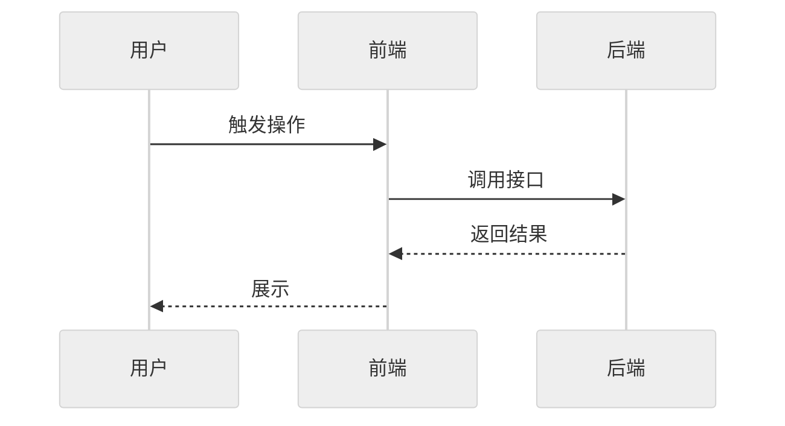
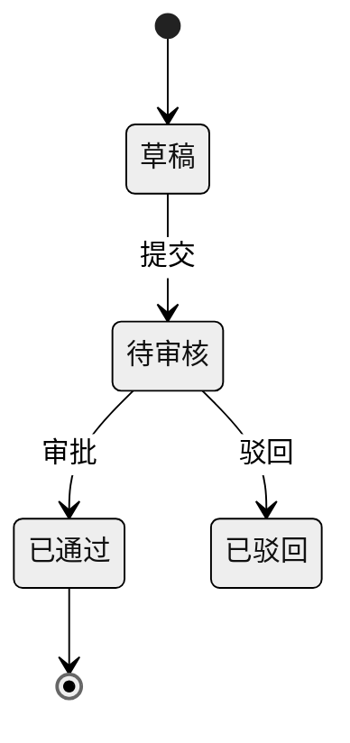

# REQ-XXX: 需求标题

## 元信息

| 属性 | 值 |
|-----|-----|
| 编号 | REQ-XXX |
| 类型 | 后端 / 前端 / 全栈 |
| 状态 | 草稿 |
| 模块 | - |
| 优先级 | P2 |
| 创建日期 | YYYY-MM-DD |
| 负责人 | - |
| branch | - |
| issue | - |

## 生命周期

<!-- 需求状态流转：草稿 → 待评审 → 评审通过 → 开发中 → 测试中 → 已完成 -->

- [ ] 草稿（编写中）
- [ ] 待评审
- [ ] 评审通过
- [ ] 开发中
- [ ] 测试中
- [ ] 已完成

---

## 一、需求描述

### 1.1 背景

简要说明需求产生的背景...

### 1.2 目标

- **功能目标**：本需求要实现的能力...
- **效果目标**：上线后的预期效果（尽量量化，如提效 XX%、减少 XX 次人工操作）...

### 1.3 客户场景

> 记录客户提出的原始业务场景和诉求

- **场景1**：客户描述...
- **场景2**：客户描述...

### 1.4 价值

实现后带来的业务价值...

### 1.5 范围与边界

> 明确本期做什么、不做什么，防止范围蔓延

- **本期包含**：...
- **本期不做**：相关但不纳入当前需求的场景，列出以便对齐预期...

### 1.6 干系人

> 除了提出方，还有哪些人会因此变化受影响

| 角色 | 关注点 | 备注 |
|------|-------|------|
| 提出方 | - | - |
| - | - | - |

---

## 二、功能清单

> 列出所有功能点，开发完成后勾选

- [ ] **功能点1**：描述...
- [ ] **功能点2**：描述...
- [ ] **功能点3**：描述...

---

## 三、业务规则

| 类型 | 规则 | 说明 |
|------|-----|------|
| 数据校验 | 规则1 | 详细说明 |
| 状态转换 | 规则2 | 详细说明 |
| 权限控制 | 规则3 | 详细说明 |
| 非功能约束 | 规则4 | 性能 / 安全 / 兼容性等约束说明 |

---

## 四、使用场景

### 场景1：XXX

- **角色**：XXX
- **前置条件**：XXX
- **基本流程**：
  1. 用户操作... → 系统响应...
  2. 用户操作... → 系统响应...
  3. 用户操作... → 系统响应...
- **异常流程**：
  - 条件A → 预期结果
  - 条件B → 预期结果

### 场景2：XXX

- **角色**：XXX
- **前置条件**：XXX
- **基本流程**：
  1. ...
- **异常流程**：
  - ...

---

## 五、数据与交互

> 根据需求类型填写不同内容：
> - **后端 / 全栈**：描述需要的接口能力和业务语义，技术方案在 `/req:dev` 阶段生成
> - **前端**：描述页面交互逻辑，`/req:dev` 阶段自动匹配后端接口

### 后端/全栈：接口需求

| 能力 | 输入 | 输出 | 说明 |
|------|------|------|------|
| 创建XXX | 业务字段描述 | 创建结果 | 业务语义说明 |
| 查询XXX | 筛选条件描述 | 列表/详情 | 业务语义说明 |

### 前端：交互逻辑

> 按页面/模块描述用户操作和数据流转，不指定具体接口

**页面：XXX**

| 操作/区域 | 用户行为 | 数据需求 | 交互反馈 |
|----------|---------|---------|---------|
| 列表区域 | 进入页面 | 分页数据（字段1、字段2...） | 加载中 → 展示列表 / 空状态 |
| 搜索 | 输入关键词、选择筛选条件 | 按条件过滤列表 | 实时刷新列表 |
| 操作按钮 | 点击审核/删除/导出 | 提交操作结果 | 成功提示 / 失败原因 |

---

## 六、测试要点

### 6.1 技术测试

- [ ] 测试点1：描述测试场景和预期结果
- [ ] 测试点2：描述测试场景和预期结果

### 6.2 验收标准

> 产品/业务方验收时的确认项，描述可观测的业务结果

- [ ] 验收项1：在什么页面/入口，执行什么操作，能看到什么结果
- [ ] 验收项2：...

---

## 七、图示（可选）

> 用 Mermaid 绘制，GitHub/Gitea 原生渲染。主题建议统一用 `neutral`（打印友好、明暗模式兼容）。
> 无图可删除本节，按需保留下方子节。

### 7.1 流程图（业务流程、用户操作路径）

### 7.2 时序图（接口调用链、前后端交互）

### 7.3 ER 图 / 状态图（按需）

---

## 八、评审记录

| 日期 | 评审人 | 结论 | 意见 |
|-----|-------|------|------|
| - | - | - | - |

---

## 九、变更记录

| 日期 | 变更内容 | 影响范围 |
|-----|---------|---------|
| YYYY-MM-DD | 初始版本 | - |

---

## 十、关联信息

- **关联需求**：REQ-XXX（前端/后端对应需求，dev 阶段自动读取其 API 设计进行接口映射）
- **相关文档**：链接
- **假设**：相信为真但未验证的前提，一旦不成立需重新评估方案（如"假设第三方接口可用率 > 99.9%"、"假设用户规模不超过 10 万"）
- **外部依赖**：依赖的第三方接口 / 其他团队交付 / 基础设施等，标注预计就绪时间
- **风险项**：技术风险（方案不确定）/ 数据风险（存量迁移）/ 时间风险（依赖外部排期）

---

## 十一、实现方案

> 本章节在 `/req:dev` 阶段由 AI 分析代码后自动生成，创建需求时无需填写。

### 11.1 数据模型

_开发阶段填充_

### 11.2 API 设计

> 基于第五章接口需求，结合项目代码和 CLAUDE.md API 风格，生成具体技术方案

_开发阶段填充_

### 11.3 文件改动清单

_开发阶段填充_

### 11.4 实现步骤

_开发阶段填充_
